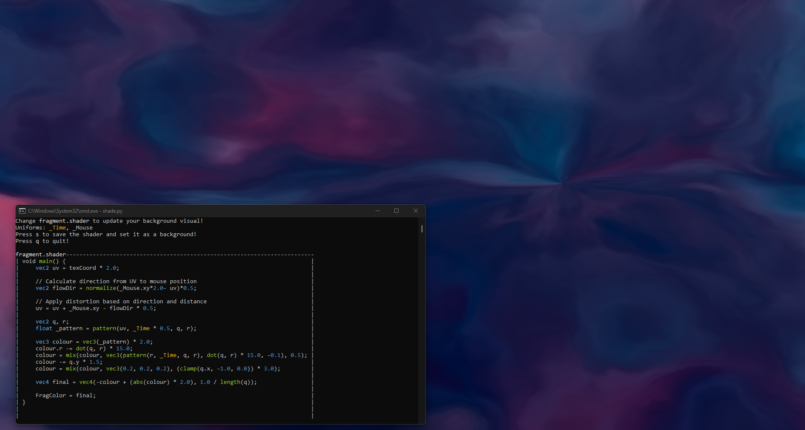
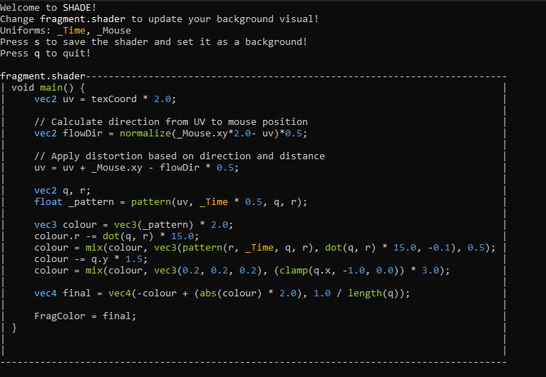

# SHADE - Live Shader Background Tool

- Render shaders as your background in **real time**!
- Use uniforms provided by the program to bring your shader to life: **_Time**, **_Mouse**
- Less then **50mb** of RAM usage(More then half of it just the OpenGL instance)

**Run**
 ```bash
py shade.py shaders/filename.shader
```
Or run **app.py** and use the GUI created with [Pype](https://github.com/kokasmark/pype)

**Plans**
- Passing window positions for effects
- Passing icon positions for effects


**Using the tool**


**Stylized preview of your background's code**
