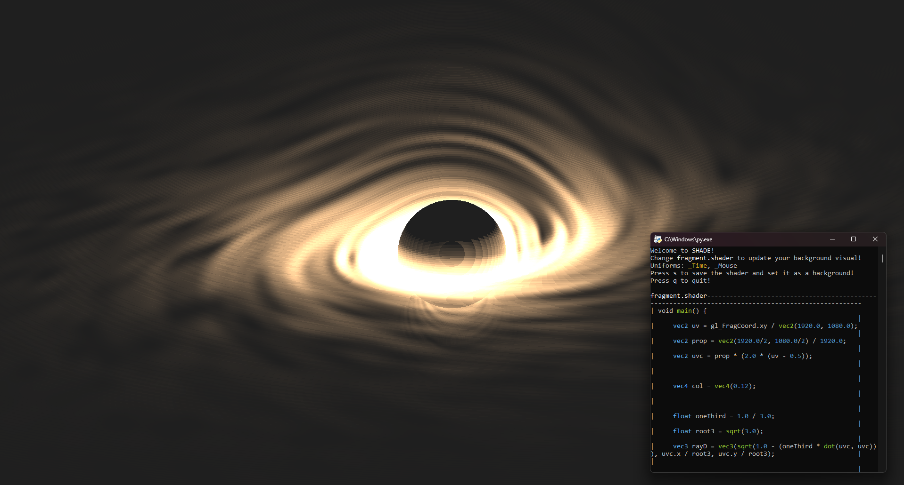

# SHADE - Live Shader Background Tool

- Render shaders as your background in **real time**!
- Use uniforms provided by the program to bring your shader to life: **_Time**, **_Mouse**
- Less then **50mb** of RAM usage(More then half of it just the OpenGL instance)

**Using the tool**

**Stylized preview of your background's code**
